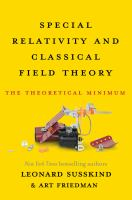

<!-- Rating: ★★★★★ -->

## Summary

This books is the third volume in the series `The Theoretical Minimum` 
and is designed to teach readers the minimum concepts and mathematics
needed to understand:
- Einstein's Special Relativity
- Classical Field Theory 

It uses real equations and you must be familiar with calculus and tensor
notation rather than a pure verbal description.

## Contents

- Introduction
- The Lorentz Transformation
- Velocities and 4-vectors
- Relativistic Laws of Motion
- Classical Field Theory
- Particles and Fields
- Crazy Units
- The Lorentz Force Law
- Fundamental Principles and Gauge Invariance
- Maxwell's Equations
- Physical Consequences of Maxwell's Equations
- Maxwell From Lagrange
- Fields and Classical Mechanics
- Appendix A. Magnetic Monopoles : Lenny Fools Art
- Appendix B. Review of 3-vector Operators

<!--
Inline: $E=mc^2$

$$
\int_a^b f(x)\,dx
$$
-->